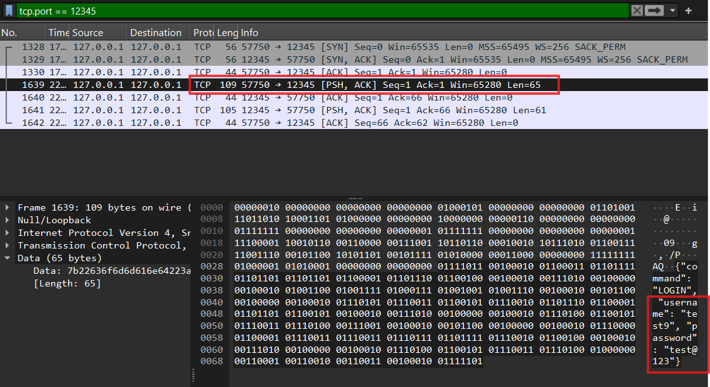
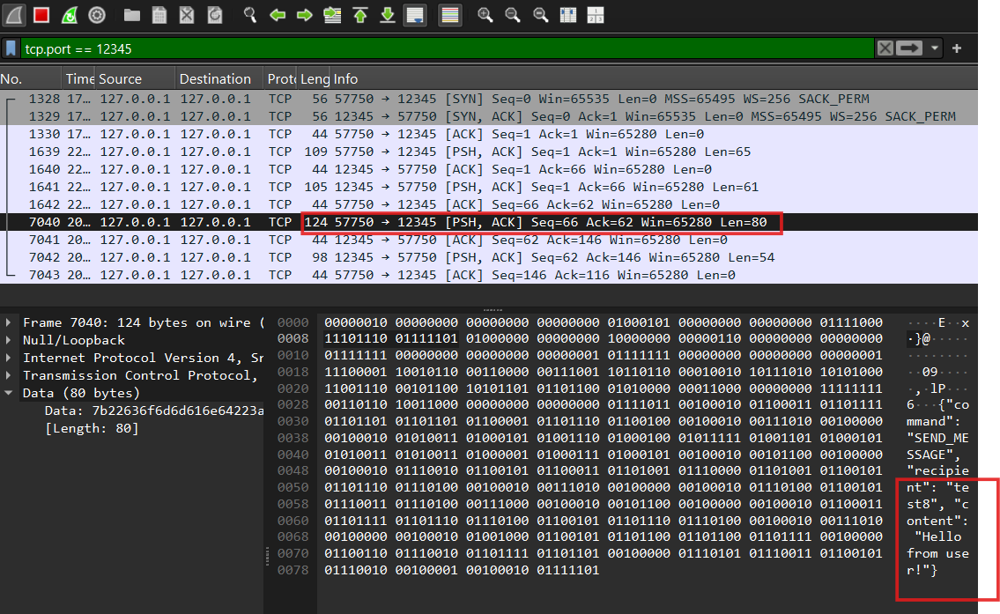

# Report for ECE 572

---

**Course**: ECE 572; Summer 2025
**Instructor**: Dr. Ardeshir Shojaeinasab
**Student Name**: Yazhini Venkatraman  
**Student ID**: V01049681
**Assignment**: Assignment 1  
**Date**: 18 June 2025  
**GitHub Repository**: https://github.com/yazhinivenkatraman/ECE572_Summer2025_SecureText.git

---

## Executive Summary

<!-- 
Provide a brief overview of what you accomplished in this assignment. 
For Assignment 1: Focus on vulnerabilities found and security improvements made
For Assignment 2: Focus on authentication enhancements and Zero Trust implementation  
For Assignment 3: Focus on cryptographic protocols and end-to-end security
Keep this section to 1-2 paragraphs.
-->

[Write your executive summary here]

---

## Table of Contents

1. [Introduction](#introduction)
2. [Task Implementation](#task-implementation)
   - [Task 1: Security Vulnerability Analysis](#task-x)
   - [Task 2: Securing Passwords at Rest](#task-y)
   - [Task 3: Network Security and Message Authentication](#task-z)
3. [Security Analysis](#security-analysis)
4. [Attack Demonstrations](#attack-demonstrations)
5. [Performance Evaluation](#performance-evaluation)
6. [Lessons Learned](#lessons-learned)
7. [Conclusion](#conclusion)
8. [References](#references)

---

## 1. Introduction
This report analyzes security and privacy vulnerabilities in the SecureText application, an intentionally insecure console-based messaging app. The primary focus is to identify fundamental security flaws, understand their implications, and lay the groundwork for secure design principles. The work done in this assignment will guide further tasks related to password storage and network message authentication.

### 1.1 Objective
<!-- Describe the main objectives of this assignment -->
To identify and document at least five major security and privacy vulnerabilities in the SecureText messenger application through manual testing and code analysis.

### 1.2 Scope
<!-- Define what you implemented and what you focused on -->
This report focuses on running and exploring the SecureText application and analyzing its vulnerabilities. Subsequent tasks on secure password storage and secure messaging will be completed later.

### 1.3 Environment Setup
<!-- Briefly describe your development environment -->
- **Operating System**: Linux (5.15.0-kali2)
- **Python Version**: 3.10.4
- **Key Libraries Used**: 
- **Development Tools**: Wireshark, TCPdump, Python

---

## 2. Task Implementation

### 2.1 Task 1: Security Vulnerability Analysis

### 2.1.1 Explore the Application:

The SecureText console application was launched and interacted using the terminal.
- Created multiple user accounts with weak passwords (including single-character passwords).
- Logged in, logged out, and attempted to log back in.
- Sent messages between users.
- Attempted to send messages to non-existent users.
- Triggered password reset flow.
- Tested user listing and interface behavior after messaging.<br>
This exploration revealed several functional and security-related issues, which are detailed below.

#### 2.1.2 Vulnerability Analysis: Identify and document at least 5 major security and privacy vulnerabilities in the application. For each vulnerability:

**Describe the vulnerability and its location in the code**
**Explain the potential impact if exploited by an attacker**
**Reference relevant security principles from course materials**
**Categorize the vulnerability (e.g., authentication, authorization, data protection, etc.)**

#### Vulnerability 1: Weak Password Policy
##### Vulnerability and its location in the code:
- Passwords can be as short as 1 character. No password strength checks exist in create_account().

```
def create_account(self, username, password):
    """Create new user account - stores password in PLAINTEXT!"""
    if username in self.users:
        return False, "Username already exists"
    
    # SECURITY VULNERABILITY: Storing password in plaintext!
    self.users[username] = {
        'password': password,  # PLAINTEXT PASSWORD!
        'created_at': datetime.now().isoformat(),
        'reset_question': 'What is your favorite color?',
        'reset_answer': 'blue'  # Default for simplicity
    }
    self.save_users()
    return True, "Account created successfully"
```


##### Potential impact if exploited by an attacker:
- Makes it easy for attackers to brute-force passwords and compromise accounts.

##### Relevant security principles from course materials:
- Secure Defaults, Authentication

##### Category:
- Authentication

#### Vulnerability 2: Insecure Password Reset
##### Vulnerability and its location in the code:
- In reset_password(), only the username is required to reset a password. The current password is not verified.

```
    def reset_password(self, username, new_password):
        """Basic password reset - just requires existing username"""
        if username not in self.users:
            return False, "Username not found"
        
        # SECURITY VULNERABILITY: No proper verification for password reset!
        self.users[username]['password'] = new_password
        self.save_users()
        return True, "Password reset successful"
```

##### Potential impact if exploited by an attacker:
- An attacker can hijack any account by resetting the password with just the username.

##### Relevant security principles from course materials:
- Authentication, Data Protection

##### Category:
- Authentication

#### Vulnerability 3: No Recipient Username Validation Before Messaging
##### Vulnerability and its location in the code:
- In the send_message() function, the recipient username is not validated before sending a message.

```
elif command == 'SEND_MESSAGE':
   if ...
   else:
      recipient = message.get('recipient')
      ...               
      # Send message to recipient if they're online
      if recipient in self.active_connections:
         ...
         try:
            self.active_connections[recipient].send(...)
```

##### Potential impact if exploited by an attacker:
- Messages could be silently dropped or used to probe for valid usernames, potentially leaking metadata.

##### Relevant security principles from course materials
- Input Validation, Authorization

##### Category:
- Authorization

#### Vulnerability 4: Broken Login/Logout Session Flow
##### Vulnerability and its location in the code:
- After a user logs out, attempting to log in again does not work as expected. Likely a bug in session state handling within the client loop.
- Re-login might fail due to stale socket/thread state after logout.

```
print("3. Logout")
...
   elif choice == '3':
      self.logged_in = False
      self.running = False
      self.username = None
      print("Logged out successfully")
...        
if self.socket:
   self.socket.close()
   print("Goodbye!")
```

##### Potential impact if exploited by an attacker:
- Prevents legitimate re-logins, leading to denial-of-service for valid users.

##### Relevant security principles from course materials:
- Session Management

##### Category:
- Authentication / Availability

#### Vulnerability 5. User Listing Not Working
##### Vulnerability and its location in the code:
- The LIST_USERS command does not return any user data, despite accounts being created. Server-side logic fails to display users.
- This logic is present, but either the connection is not active or message handling fails on client side.

```
elif command == 'LIST_USERS':
...
   else:
      online_users = list(self.active_connections.keys())
      all_users = list(self.users.keys())
```

##### Potential impact if exploited by an attacker:
- Users cannot discover or connect with others, disrupting communication flow.

##### Relevant security principles from course materials:
- Least Privilege, Secure Feedback

##### Category:
- Authorization

#### Vulnerability 6. Plaintext Password Storage
##### Vulnerability and its location in the code:
- The application stores user passwords in plaintext without any hashing or salting.
- The vulnerability is present in the create_account() method in the SecureTextServer class:

```
# SECURITY VULNERABILITY: Storing password in plaintext!
        self.users[username] = {
            'password': password,  # PLAINTEXT PASSWORD!
            'created_at': datetime.now().isoformat(),
            'reset_question': 'What is your favorite color?',
            'reset_answer': 'blue'  # Default for simplicity
        }
        self.save_users()
```

##### Potential impact if exploited by an attacker:
- If the users.json file is accessed (e.g., by a malicious server admin or via a file read vulnerability), all user credentials are compromised instantly.
- Attackers can reuse passwords across other platforms where users may have used the same password.

##### Relevant security principles from course materials:
- Data Protection
- Defense in Depth
- Authentication

##### Category:
- Data Protection / Authentication


### 2.1.3 Attack Scenarios: For each identified vulnerability, describe a realistic client-server attack scenario explaining:

#### Vulnerability 1: Weak Password Policy
**What they would need to carry out the attack:**
- A tool to brute-force login credentials (e.g., Hydra)
- A known or guessed username (e.g., “admin”, “test”, etc.)                                 

**What they could achieve if successful:**
- Gain unauthorized access to a user account using a short, easily guessed password like a or 123.
- Send messages, list all the users pretending to be that user.

**Final thoughts and consideration:**
- The lack of password strength requirements makes the system extremely vulnerable to brute-force and dictionary attacks. Enforcing minimum password length and complexity is essential.

#### Vulnerability 2: Insecure Password Reset
**What they would need to carry out the attack:**
- A valid username is needed to carry out the attack (which may be easy to guess or obtained from prior reconnaissance)

**What they could achieve if successful:**
- Reset the password of an existing user and gain full control over their account.
- Block the original user from accessing their own account.
- Able to listen to messages which are directed to this user account.

**Final thoughts and consideration:**
- Without verifying the current password or using security questions/other verification, the password reset process is critically flawed. This is a common real-world vulnerability.

#### Vulnerability 3: No Recipient Username Validation Before Messaging
**What they would need to carry out the attack:**
- A logged-in user session is needed.
- The ability to send a message to any arbitrary or non-existent username.

**What they could achieve if successful:**
- Waste system resources by sending messages to non-existent users.
- Enumerate valid usernames (via trial and error), aiding further user attacks by resetting password.
- Cause confusion or loss of messages due to misdirected communication.

**Final thoughts and consideration:**
- The application should verify that recipients exist and give clear error feedback. This affects both usability and security.

#### Vulnerability 4: Broken Login/Logout Session Flow
**What they would need to carry out the attack:**
- A user logged in once and then logged out
- Attempt to log in again during the same session

**What they could achieve if successful:**
- Unable to re-login into same account, without restarting the application.
- Causes denial of service (DoS) for the user and may discourage legitimate use.

**Final thoughts and consideration:**
- Poor session handling affects availability and usability. User logout should clear the session state completely and allow re-authentication properly.

#### Vulnerability 5. User Listing Not Working
**What they would need to carry out the attack:**
- A logged-in user attempting to view the list of online or registered users using the LIST_USERS command.

**What they could achieve if successful:**
- Users can't discover others to message, breaking communication
- Limits ability to verify if other users are online or valid

**Final thoughts and consideration:**
- Listing users is essential for usability in a chat application. If not working, it indirectly affects both authorization (knowing who is active) and user trust.

#### Vulnerability 6. Application Freezes After Sending Message
**What they would need to carry out the attack:**
- A user logged in, using the send_message() function to send a message to another user.

**What they could achieve if successful:**
- Once a message is sent, the user is stuck without a way to continue using the app, essentially locking them out of further actions.

**Final thoughts and consideration:**
- This is more of a usability and robustness issue but can still lead to an unintentional denial-of-service. Input loops must be correctly managed.


## 2.2 Task 2: Securing Passwords at Rest

### Part A: Password Hashing Implementation
#### 1. Replace Plaintext Storage:

**Modify the create_account() method to hash passwords before storing**
```
def create_account(self, username, password):
        """Create new user account - stores password in PLAINTEXT!"""
        if username in self.users:
            return False, "Username already exists"
        
        # Hash the password using SHA-256
        password_hash = hashlib.sha256(password.encode()).hexdigest()

        # SECURITY VULNERABILITY: Storing password in plaintext!
        self.users[username] = {
            'password': password_hash,  # PLAINTEXT PASSWORD!
            'created_at': datetime.now().isoformat(),
            'reset_question': 'What is your favorite color?',
            'reset_answer': 'blue'  # Default for simplicity
        }
        self.save_users()
        return True, "Account created successfully"
```

**Update the authenticate() method to compare hashed passwords**
```
def authenticate(self, username, password):
        """Authenticate user with plaintext password comparison"""
        if username not in self.users:
            return False, "Username not found"
        
        # Hash the entered password before comparison
        entered_hash = hashlib.sha256(password.encode()).hexdigest()
        stored_hash = self.users[username]['password']

        # SECURITY VULNERABILITY: Plaintext password comparison!
        if entered_hash == stored_hash:
            return True, "Authentication successful"
        else:
            return False, "Invalid password"
```

**Use SHA-256 initially, then discuss its limitations**
- SHA-256 provides a secure hashing function, it is not ideal for password storage because it is too fast and lacks built-in protections against brute-force attacks.
- In future tasks, this implementation should be replaced with a slow hashing algorithm like PBKDF2, bcrypt, scrypt, or Argon2, which incorporate computational delays, salting to resist dictionary attacks and rainbow table attacks.

#### 2. Implement Slow Hashing:

**Research and implement a slow hash function (PBKDF2, bcrypt, scrypt, or Argon2)**
Implemented bcrypt slow hash function.

```
# Utility function for testing the hashing speed in SHA-256 and bcrypt methods
def test_hashing_time():
    check_hash_time = input("Enter 1 to test SHA-256 & bcrypt hashing time orelse enter 0: ")
    if check_hash_time == "1":
        # Using sample password to check the timing difference
        password = "TestP@$$word123"

        # Time taken for SHA-256 hashing technique
        start = time.time()
        password_hash = hashlib.sha256(password.encode()).hexdigest() 
        end = time.time()
        print("SHA-256 hashing took " + str(float(end - start)) + " seconds")

        # Time taken for Bcrypt hashing technique
        start = time.time()
        password_hash = bcrypt.hashpw(password.encode(), bcrypt.gensalt()).decode()
        end = time.time()
        print("Bcrypt hashing took " + str(float(end - start)) + " seconds")
    else:
        pass
```

**Justify your choice of hash function and parameters**
- Bcrypt does intentionally slow hashing, very effective for securing password and provides in-build salting function, which makes it resistant to brute-force attacks. 

- Adaptive Work Factor:
The work factor or cost factor can be adjusted to increase the computational time required to hash a password. This ensures that even with advancements in hardware, bcrypt remains effective by simply increasing the cost.

- Built-in Salting:
This function automatically generates unique salt for each given password. This prevents attackers from using precomputed hash tables or rainbow tables to crack passwords. Also each hash is unique even for identical/same passwords.

- Secure by Design:
Bcrypt uses Blowfish cipher which protects from known cryptographic attacks.

- Cross platform support:
Bcrypt library is readily available in python which is easy to integrate and maintain, also widely supported across various systems.

- Cost Value:
I used bcrypt.gensalt() with the default cost factor typically 12, which is reasonable computation time and resistance to attacks. This produces a hash with 2¹² iterations which is secure enough to most attacks.

**Demonstrate the time difference between fast and slow hashing**
- Time difference between SHA-256 and Bcrypt hashing technique is calculated with the test_hashing_time() function. 
- Used a sample password "TestP@$$word123" for both hashing techniques. 
- With the help of time module in python, precisely calculated the time taken to hash the sample password.
- Below is the hashing time generated for both SHA-256 and Brcupt hashing functions.

```
Enter 1 to test SHA-256 & bcrypt hashing time orelse enter 0: 1
SHA-256 hashing took 0.0 seconds
Bcrypt hashing took 0.39643406867980957 seconds
SecureText Server started on localhost:12345
```
- SHA-256 is very quick enough to hash the password in 0s while Bcrypt takes ~0.396s approximately to hash the same password.

### Part B: Salt Implementation
#### Add Salt Generation:

**Generate a unique random salt for each user (minimum 128 bits)**
In the create_account() method, I generated a 128-bit (16-byte) salt for each user using Python’s os.urandom(16) function and then base64-encoded it to safely store.

```
        # Updating password hashing to generate 128-bit (16-byte) and store salt manually.
        salt = base64.b64encode(os.urandom(16)).decode()
    
        # Initially combining salt and password, then hashing using bcrypt
        salted_password = password + salt
        password_hash = bcrypt.hashpw(salted_password.encode(), bcrypt.gensalt()).decode()
```

**Store the salt alongside the hashed password**
Salt is stored along with password in the users.json file.
```
# SECURITY VULNERABILITY: Storing password in plaintext!
        self.users[username] = {
            'password': password_hash,  # PLAINTEXT PASSWORD!
            'salt': salt,
            'created_at': datetime.now().isoformat(),
            'reset_question': 'What is your favorite color?',
            'reset_answer': 'blue'  # Default for simplicity
        }
```

**Modify authentication to use the stored salt**
In the authenticate() method, the salt corresponding to the username is retrieved and used to reconstruct the salted password for verification.

```
        stored_hash = self.users[username]['password']
        stored_salt = self.users[username].get('salt')
        # Recreate hash using stored salt
        salted_password = password + stored_salt

        # Verify hashed password using bcrypt
        if bcrypt.checkpw(salted_password.encode(), stored_hash.encode()):
            return True, "Authentication successful"        
```


#### Migration Strategy:

Implement a method to migrate existing plaintext passwords
Ensure backward compatibility during the transition

- Legacy users (with SHA-256 password hash without salting) login when the bcrypt scheme is implemented, after successful authentication, the legacy password will be hashed using bcrypt. 
- In this process, a new 128-bit salt is generated.
- Password is rehashed using bcrypt, that is password + salt.
- The legacy users password and salt are updated in database.
This ensures backward compatibility.

```
"test9": {
    "password": "8622f0f69c91819119a8acf60a248d7b36fdb7ccf857ba8f85cf7f2767ff8265",
    "created_at": "2025-06-14T19:06:44.882655",
    "reset_question": "What is your favorite color?",
    "reset_answer": "blue"
  },
```

```
def authenticate(self, username, password):
        ...
        if not stored_salt:
            # Updating authentication for legacy users, to successful login and update salt later.
            legacy_hash = hashlib.sha256(password.encode()).hexdigest()

            if legacy_hash == stored_hash:
                new_salt = base64.b64encode(os.urandom(16)).decode()
                ...
            
        # Recreate hash using stored salt
        salted_password = password + stored_salt

        # Modern user - verify hashed password using bcrypt
        if bcrypt.checkpw(salted_password.encode(), stored_hash.encode()):
            ...
```
```
=== Login ===
Enter username: test9
Enter password: test@123
Authentication successful - Legacy user migrated
```
```
"test9": {
    "password": "$2b$12$f/ErnT8ZVuoP25V1yhChFOYM5ztXu0Z5T50wcBASmF5j5.M3amAoa",
    "created_at": "2025-06-14T19:06:44.882655",
    "reset_question": "What is your favorite color?",
    "reset_answer": "blue",
    "salt": "zMvCPp4PB7HnYeHvHMMpBg=="
  },
```

#### Attack Demonstration
#### Dictionary Attack Simulation:
**Create a simple dictionary attack against unsalted hashes**
- A simple dictionary attack was created using python (password_dict_attack.py) to run agains the SHA-256 hashed passwords.
- Made to run it agains the common passwords which are stored in password_dictionary.txt file (contains "password, 123456, qwerty, test@123", etc).
- Attack was successful for weak passwords.

```
Checking for user: test9
Password not found in dictionary.

Checking for user: test10
Password for user 'test10' is: test@123
```

**Show how salting defeats this attack**
- I extended the same dictinary attack to run against salted bcrypt hashes.
- For salted passwords, attacker must recompute a hash for each disctionary word by using the stored salt. And finally need to verify it against the stored hash.
- In real life, this becomes computationally expensive and ineffective. 
- By below outcomes, it is evident that salting makes dictionary attacks much harder and often not feasible.

```
  "test3": {
    "password": "$2b$12$fpWqIIRYZTggThNN2/dSsuhCKbKf5z7t6j3lLqp.EqntIxvLzMYtC",
    "salt": "tK6cn7DA8N4UKY/knzAckA==",
    "created_at": "2025-06-12T22:39:15.991503",
    "reset_question": "What is your favorite color?",
    "reset_answer": "blue"
  },
```
```
Trying dictionary attack on user: test3
Dictionary attack failed: Salting defeated the attack.
```

**Demonstrate rainbow table protection**
- SHA-256 hashes were cracked easily using dictionary and rainbow table attacks.
- Salted bcrypt hashes prevented both attacks.
- The attacker cannot precompute rainbow tables for unknown salts.
- Dictionary attack fails as the known passwords produce different hashes.

```
Rainbow table attack on user: test9
Rainbow table failed to crack the password.

Rainbow table attack on user: test10
Rainbow table matched! Password is: test@123
```

#### Performance Analysis:
Compare cracking times for fast vs. slow hash functions
Calculate theoretical brute-force times for your implementation

### 2.3 Task 3: Network Security and Message Authentication
### Part A: Network Attack Demonstrations
#### Eavesdropping Attack:

**Set up network traffic capture using Wireshark or tcpdump**
**Capture and display plaintext messages between users**
**Filter traffic to show only SecureText communication**
**Document the setup and provide evidence (screenshots/logs)**

- To demonstrate network traffic capture I used Wireshark tool.
- Filtered the packet capture to restrict only to the port 12345 by "tcp.port == 12345"
- Tried to login into a user account and captured username and password in plaintext. 



- Sent messages between user and sniffed the packets using wireshark. 



- Able to view and read the plaintext message sent from one user to another over network.

#### Message Tampering Concept:

**Explain how an attacker could intercept and modify messages**
1. Man in the Middle Attack: 
- The attacker position themself between the client and the server and observer the communication happens between them. 
- This can be done using Spoofing ARP tables.
- Setting up an access point (AP) over the open WiFi networks.

2. Reading TCP Packets:
- Using Wireshark or TCPdump, attacker can capture pcakets sent between server and client. 
- Read the desired information and manipulate contents.

3. Modifying Data & Sending Altered Packets Over Network:
- After capturing packets, attacker is able to change message data, sender and receiver information or add malicious payloads.
- These packets can be send over the same network.

**Describe the tools and techniques needed for active attacks**
- Wireshark / TCPdump: Packet capture and inspection tool
- Ettercap: Man in the Middle attack execution , ARP Spoofing and manipulating packets
- Scapy: Packet customization and injection into network
- Nmap: To scan networks, identify open ports and discover devices connected to the network.
- Netcat: Network communication, port scanning and even remote access.  

### Part B: Flawed MAC Implementation
#### Implement H(k||m) MAC:

**Add a flawed MAC using the construction MAC(k,m) = MD5(k||m)**
- Created a helper function generate_flawed_mac()

```
def generate_flawed_mac(message: str) -> str:
    return hashlib.md5(SHARED_KEY + message.encode()).hexdigest()
```

**Implement shared key distribution (simple pre-shared key is acceptable)**
- A pre-shared key (SHARED_KEY) is used for message authentication. 
- It is hardcoded in both the server and client for simplicity.

**Add MAC verification to message processing**
- To enhance message integrity and authenticity, implemented a flawed Message Authentication Code (MAC) using the construction: MAC(k, m) = MD5(k || m), where:
k is a shared secret key,
m is the message content, and
MAC is added to each message and verified on receipt.

**Client-side:**
- Before sending a message, we compute mac = MD5(shared_key + message) using the helper function.
- Message is sent with the computed MAC.

**Server-side:**
- Upon receiving a message, the server recomputes the MAC.
- If the MAC received matches, the message is accepted and forwarded.
- If the MAC does not match, the server rejects the message.

#### Message Format Enhancement:

**Modify messages to support commands(by sending a switch as a function input) (e.g., "CMD=SET_QUOTA&USER=bob&LIMIT=100")**
- Added a user prompt in the client’s send_message() function which allows the user to specify whether the message is a command or regular message.
**Code Snippet (Client – send_message):**
```
msg_type = input("Is this a command message? (y/n): ").strip().lower()

if msg_type == 'y':
# Command message
    content = input("Enter command (e.g., CMD=SET_QUOTA&USER=bob&LIMIT=100): ").strip()
else:
    content = input("Enter regular message: ").strip()
```

- We modified the client to format certain messages.
```
CMD=SET_QUOTA&USER=bob&LIMIT=100
```

- This allows us to simulate typical command-control messages in a key-value format, which can be decoded on the server.

**Ensure the application can process these structured messages as key value format**
- Preserved command strings in CMD=KEY&VAL format, which is common in HTTP or query strings. Treated the message as a simple string with MAC protection.

**Implement MAC verification for command messages(keep it simple)**
- A flawed MAC using MAC(k||m) = MD5(k||m) was used to authenticate all the messages. This is added as a separate field in the message and verified on the server side.
- When the MAC matches, command or message is accepted.
- When the MAC fails, message is rejected.

**MAC generation**
```
def generate_flawed_mac(message, key):
    return hashlib.md5(key + message.encode()).hexdigest()
```

**Code Snippet - Client - send_message()**
```
        mac = generate_flawed_mac(content)
        
        command = {
            'command': 'SEND_MESSAGE',
            'recipient': recipient,
            'content': content,
            'mac': mac
```

**Server – Verify MAC**
```
expected_mac = generate_flawed_mac(msg_content)
if mac != expected_mac:
    response = {'status': 'error', 'message': 'MAC verification failed'}
```

**Client – Display MAC result**
```
if message.get('mac') == expected_mac:
    print(f"\n[{message['timestamp']}] {message['from']}: {message['content']} (MAC verified)")
else:
    print(f"\n[{message['timestamp']}] {message['from']}: {message['content']} (MAC failed)")
```


### Part C: Length Extension Attack
Implement Vulnerable MAC:

Implement the flawed MAC construction MAC(k,m) = MD5(k||m) exactly as described in course notes
Use the Merkle-Damgård construction vulnerability
Create a message format that supports commands: "CMD=SET_QUOTA&USER=bob&LIMIT=100"
Length Extension Attack Implementation:

Use hash_extender or HashPump tools or implement the length extension attack from scratch to exploit and run the attack
Demonstrate the exact attack scenario from course:
Original: "CMD=SET_QUOTA&USER=bob&LIMIT=100"
Forged: "CMD=SET_QUOTA&USER=bob&LIMIT=100&padding&CMD=GRANT_ADMIN&USER=attacker"
Show that MAC(k, original_msg) can be extended to MAC(k, forged_msg) without knowing k You need to use packet sniffing tools to get the message first and then forge and send.


### Part D: Secure MAC Implementation
Replace with Secure MAC:

Implement HMAC-SHA256 or another secure MAC construction
Ensure compatibility with existing message format
Document why this construction is secure
Security Analysis:

Explain why HMAC resists length extension attacks
Compare the security properties of your implementations
Discuss key management considerations