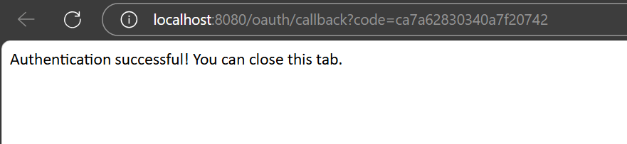

---

**Student Name**: [Yazhini Venkatraman]  
**Student ID**: [V01049681]  
**Assignment**: [Assignment 2]  
**Date**: [12 July 2025]  
**GitHub Repository**: [https://github.com/yazhinivenkatraman/ECE572_Summer2025_SecureText.git]

---

## Executive Summary

<!-- 
Provide a brief overview of what you accomplished in this assignment. 
For Assignment 1: Focus on vulnerabilities found and security improvements made
For Assignment 2: Focus on authentication enhancements and Zero Trust implementation  
For Assignment 3: Focus on cryptographic protocols and end-to-end security
Keep this section to 1-2 paragraphs.
-->

[Write your executive summary here]

---

## Table of Contents

1. [Introduction](#introduction)
2. [Task Implementation](#task-implementation)
   - [Task X](#task-x)
   - [Task Y](#task-y)
   - [Task Z](#task-z)
3. [Security Analysis](#security-analysis)
4. [Attack Demonstrations](#attack-demonstrations)
5. [Performance Evaluation](#performance-evaluation)
6. [Lessons Learned](#lessons-learned)
7. [Conclusion](#conclusion)
8. [References](#references)

---

---

## 2. Task Implementation

### 2.1 Task 4: [Multi-Factor Authentication with TOTP]

#### Part A: TOTP Implementation
- To strengthen the User authentication mechanism, I have implemented a Time based One-Time Password methon.
- In this mechanism, when the new user is created, TOTP secret is enabled which is securely stored with the password and salt. 
- Using **pyotp** python library, TOTP secret is generated and URI is in the below format:

```
otpauth://totp/SecureText:<username>?secret=<base32_secret>&issuer=SecureText
```

- Python library named **qrcode** is used to enclode this URI in QR code image. Then the encoded QR code is displayed directly in the server terminal using ASCII format. 


- After account creation users can scan the QR code using an authenticator app and the TOTP will be generated.
- I have used an Authenticator application from app store compatible for iPhones. Which generates TOTP every 30 seconds.


- task4_partA_img1.png shows that the QR code is generated on the server side when a new user account is created. 
- During the time of login with user name and password, it prompts for OTP secret, meanwhile the Authenticator mobile app, generates TOPT every 30 seconds. 


- After entering the TOTP, user is successfully logged in to created user account.


#### Part B: Security Analysis and Attack Demonstrations
**1. Demonstrate Authentication Bypass:**
**Scenario:**
Let us take a scenario of a user's password is compromised via phishing or with data breach.

**Without TOTP:**
An attacker who only has the password could login and take the possession of the user login.

**With TOTP:**
Even with the correct username and password, the attacker cannot login into user account. They need the current valid TOTP code generated on the user’s authenticator app. This could prevent the attack from happening.

**Conclusion:**
This demonstrates that TOTP prevents unauthorized login attacks, even when the user account passwords are compromised. This TOTP method effectively mitigating many common password-based attacks. 

**2. TOTP Security Analysis:**
**Cryptographic Basis:**
- HMAC-SHA1 is used to build TOTP.
- During account creation a shared secret is been established.
- TOTP works by hashing the secret with a moving timestamp generally in 30-second windows, ensuring that codes are time-based one-time use.

**Time Synchronization Issues:**
- TOTP depends mostly on the system time on both the client and the server.
- Python libraries like pyotp allow 1-step window tolerance to handle slight time drifts.
- It is very important to keep the system clock in sync with Network Time Protocol.

**Backup & Recovery:**
- TOTP is always device-bound (30 seconds). If the user loses their phone, access is completely lost unless they have some backup codes included with account during the time of setup.
- An account recovery process might be needed in place.


**3. Attack Vectors and Mitigations:**
**SIM Swapping:**
- In a SIM-swap attack an SMS-based two-factor authentication, an attacker might convinces the telecom provider to port your number to their SIM.
- Any SMS based OTP sent for 2FA could be intercepted.
- TOTP-based apps are more immune to SIM swapping because phone numbers are not included in the authenticator apps.

| Factor               | SMS-based 2FA     | TOTP-based 2FA     |
|----------------------|-------------------|---------------------|
| Delivery method      | Over carrier network | On-device app     |
| Vulnerable to SIM swap | Yes              | No                  |
| Internet required     | No               | No                  |
| Setup complexity      | Easy             | Moderate (QR scan)  |
| Security              | Medium           | High                |

**Phishing Resistance:**
- Normal phishing pages can able to request the OTP from authenticator app, but it’s usable only for a short window basically 30 seconds.
- More secure variants such as WebAuthn or U2F are more phishing-resistant.
- TOTP improves user account security significantly over just username and passwords but is not fully phishing-proof.

#### Part C: User Experience Considerations

**Security vs. Usability:**

- **Rate Limiting:** Although this is not implemented in this version, it is very important to limit the number of TOTP attempts using authenticator app during a single login to prevent brute-force attacks. During this implementation we should avoid user lockouts due to simple mistakes.
   
- **Time Window Tolerance:** TOTP inherently allows a small time window 30 seconds in most cases, to account for slight clock drift between the client and server. This improves usability without significantly weakening security.
   
- **Helpful Error Messages:** The system provides user-friendly error messages during login, e.g., "Invalid TOTP code", "Missing TOTP code". This helps in reducing the information leakage like username is incorrect or password is incorrect. 

---

### 2.2 Task 5: [OAuth Integration]

#### Part A: Console-Compatible OAuth 2.0 Implementation
In this part, GitHub OAuth 2.0 authentication is used to let authors use their github credentials for login instead of creating a new user account. This is more encrypted and less prone to attacks.

**1. OAuth Provider Setup:**
- Github is selected as an OAuth provider.
- A new OAuth application was selected under Github Developer settings.
- A placeholder redirect URI was configured as http://localhost for console based redirection setup.

**2. Console-Based OAuth Login:**
- Upon selecting "Login with GitHub (OAuth)" the application starts a local Flask server on port 8080 to receive the OAuth callback.


- Then launches the GitHub authorization URL in the user’s default web browser, here redicrected in Edge.


- After the user logs in to GitHub and authorizes the app, GitHub redirects them to http://localhost:8080/oauth/callback?code=
- The app extracts the code and exchanges it for an access token using GitHub.

**3. User Info Extraction:**
- Once the access token is obtained, the app uses it to query.
- https://api.github.com/user – to retrieve the GitHub id and login username.
- https://api.github.com/user/emails – to extract the verified primary email, if available.
- The GitHub username is displayed in the terminal upon successful login also updated in users.json file.


**4. Hybrid Authentication:**
- Current application now supports both: 
1. Local login using username + password + TOTP.
2. GitHub OAuth login.

- If a GitHub account matches an existing local user based on github email or github username, the account is linked by updating the user record in users.json with GitHub metadata.
- If the GitHub username already exists locally but not linked to a GitHub account, it is automatically linked and updated in users.json file.
- If the username exists and is already linked to another GitHub ID, a warning is shown and login is denied to prevent unauthorized takeover.

#### Part B: Security Features

**1. Secure OAuth Flow**

Security is enhanced in the OAuth authentication process, new implementation includes the following mechanisms.

**a. CSRF Protection Using state Parameter**
- Even though the state parameter was originally omitted, GitHub still recommends it to mitigate Cross-Site Request Forgery.

- Before redirecting local users to GitHub, a random state value is generated.
- This state is sent in the authorization URL and validated after GitHub redirection.


**b. PKCE (Proof Key for Code Exchange)**
PKCE is successfully implemented in the current code flow:

- A secure code_verifier is generated using secrets.token_urlsafe(64).
- It's SHA-256 hash is base64-url encoded to form the code_challenge.
- This code_challenge is included in the authorization URL in GitHub using code_challenge_method=S256.
- An attacker cannot exchange the stolen code without the correct code_verifier.

**c. Token Handling**
- Access tokens are not stored persistently in users.json file or someother random database. They exist only in run time memory during the session.
- Sessions are short-lived, once the client disconnects or logout then the access token is discarded.
- OAuth sessions are cleanly separated from local sessions.

**2. Session Handling:**

**a. In-Memory Sessions**
The sessions state is tracked using:
- self.logged_in
- self.username
- self.running (message listener thread control)
- These flags ensures that both GitHub and local logins are treated uniformly after authentication.

**b. Logout Support**
- Resetting session flags using self.logged_in = False, self.username = None
- Halting the listener thread using self.running = False
- By this providing a consistent logout user experience.

**c. Expired or Missing Tokens**
- GitHub tokens are short-lived, when there is an issue with the tokens, this will produce an error during GitHub API call request.

#### Part C: Security Analysis
**1. Benefits of OAuth Authentication:**
a. Reduced Password Risk:

- As the users can directly authenticate with their identity provider GitHub instead of using their password directly.
- OAuth reduces the risk of password being stored in a database or share with a third-party applications.

b. Stronger Account Security:

- GitHub uses Multi-fcator authentication which is very secure than custom made authentication mechanisms.
- By using GitHub as an identity provider, SecureText benifits from well-tested security infrastructure of GitHub.

c. Simplified User Experience:

- Users can sign in easily using an existing GitHub account.
- This improves usability for users who don’t need to manage yet another password.

d. Seamless Account Linking:

- In this securetext application, if the GitHub email matches a local account from users.json file, it links the GitHub identity to the existing user profile.
- This helps to maintain credentials and enables hybrid login paths.

e. Short-Lived Session Design:

- Access tokens are not stored persistently in the system, this reduces the blast radius of a token leakage event.

**2. Known OAuth Vulnerabilities & Mitigation in Our Implementation**

| **Attack Vector**                  | **Description**                                                                 | **Mitigation in Our System**                                                                                                                                 |
|-----------------------------------|---------------------------------------------------------------------------------|--------------------------------------------------------------------------------------------------------------------------------------------------------------|
| Authorization Code Interception   | If an attacker gets the authorization code, they can exchange it for a token. | Partially mitigated via `localhost`. Additionally, PKCE (Proof Key for Code Exchange) is implemented using `S256` challenge method.       |
| Missing or Invalid State Parameter| Without a `state` parameter, attackers can perform CSRF (Cross-Site Request Forgery). | **Not yet implemented in our application**. This is a known vulnerability in the current version. A random state value should be generated and validated to mitigate CSRF.  |
| Redirect URI Manipulation         | Malicious apps could register fake redirect URIs to capture tokens.             | Mitigated by using hardcoded URI `http://localhost:8080/oauth/callback` to redirect.                   |
| Token Leakage                     | If access tokens are exposed, they can be reused by attackers. | Tokens are kept in memory and never logged to disk. Sessions are treated as short-lived and always resets on logout.                                   |

---


### 2.3 Task 6: [Zero Trust Implementation]

#### Part A: Challenge-Response Authentication

#### Part B: Role-Based Access Control (RBAC) and Session Security

#### Part C: Logging and Basic Monitoring

---